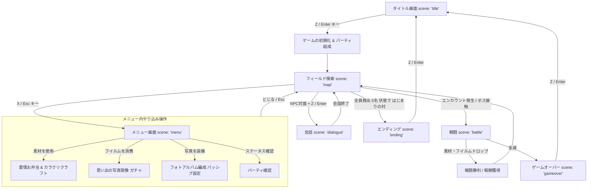

# 『かなとの大冒険 ～家族をさがして～』 ゲーム仕様書 (やり込み拡張版)

本作は、HTML5 Canvas と純粋な JavaScript (Vanilla JS) を用いて構築された、グリッドベースの2DレトロRPGゲームです。プレイヤーは主人公「かなと」となり、様々な能力を持つ家族（いぬ、かめ、まま、ぱぱ）を救出し、仲間と協力して最終目的地へと旅をします。

本仕様書は、現在までに実装されている基本機能に加え、新たに設計されたやり込み要素である**「素材収集＆クラフトシステム」**および**「思い出現像ガチャ＆絆アルバムシステム」**を包含した最新のゲーム仕様書です。

---

## 1. 基本情報 & 動作環境

| 項目 | 仕様 |
| :--- | :--- |
| **タイトル** | かなとの大冒険 ～家族をさがして～ |
| **ジャンル** | 2Dグリッド型アドベンチャーRPG（やり込み＆コレクション要素搭載） |
| **プラットフォーム** | Webブラウザ (HTML5 / CSS3 / JavaScript) |
| **画面解像度** | `640 x 480` ピクセル (Canvas表示用領域) |
| **表示スケール** | 1タイル = `32 x 32` ピクセル (横20マス × 縦13マス表示) |
| **操作方法** | <ul><li>**矢印キー（⬆⬇⬅➡）**: 移動、カーソル選択</li><li>**Zキー / Enterキー**: 決定、話しかける、メッセージ送り</li><li>**Xキー / Escapeキー**: メニュー開閉、キャンセル、スキル画面戻る</li></ul> |

---

## 2. ゲーム全体フロー & 状態遷移

ゲームの進行状態は、`GameState.scene` 変数によって一元管理されています。新要素（クラフト・現像・編成）はメニューおよびキャンプを通じて探索ループに統合されます。

### 🏆 ゲームクリア（エンディング）条件
1. パーティの救出済みメンバー（`GameState.rescuedChars`）が**全員（かなと、いぬ、かめ、まま、ぱぱ の計5名）**揃っている。
2. プレイヤーが「**はじまりの村 (village)**」に滞在している。
上記2つの条件が揃うと、バックグラウンドの監視タイマー（1秒毎）が検知し、エンディング会話イベントが自動トリガーされます。

---

## 3. 画面・機能仕様

### ① タイトル画面 (`title`)
* **背景演出**: 
  * 80個のランダムな星（`titleStars`）が個別の周期で明滅する満天の星空アニメーション。
  * 三日月、影となるなだらかな山脈のグラデーション背景。
  * 救出したキャラクターたちが画面下部でピョコピョコと跳ねる歩行アニメーション。
* **機能**: 
  * 決定キーでゲーム開始処理（`initGame()`）を行い、初期パーティ（かなとのみ）、初期ゴールド（30G）、初期マップ（はじまりの村）をロードしてフィールド探索へ遷移。

### ② フィールド探索画面 (`map`)
* **スクロールシステム**: 
  * プレイヤーキャラクター（かなと）を中心にカメラが追従（`updateCamera`）。
  * 画面外に出ないようマップ境界（マップ端）でカメラが固定される。
* **HUD表示 (画面上部)**:
  * 現在のマップ名、所持ゴールド（💰 〇〇G）。
  * パーティ全員の名前とHPバー（HP割合によってカラーが `緑 ➔ 橙 ➔ 赤` へ変化）。
* **隊列歩行 (フォロワー追従)**:
  * プレイヤーの後ろを、仲間に加わったメンバー（いぬ、かめ、まま、ぱぱ）が移動履歴の軌跡（`followerHistory`）を辿って追従します。
* **エンカウント**:
  * エンカウント率のあるマップで「草むら」などの特定の床を踏むと、設定されたエンカウント率に基づきランダムバトルが発生します。
* **画面遷移ギミック**:
  * 「出口（`exit`）」タイルに進入すると、設定された先のマップの初期位置へとシームレスに切り替わります。

### ③ 会話画面 (`dialogue`)
* **UI**: 画面下部に名前付きダイアログボックスを表示。
* **文字送りアニメーション**: 
  * 1文字あたり `40ms` のディレイでテキストが左上から流れるように表示。
  * 表示途中に決定キーを押すことで瞬時に全テキストを表示。
  * 全表示後は点滅する「▼」マークが表示され、決定キーで次のページまたは会話終了。

### ④ 戦闘画面 (`battle`)
* **バトル形式**: ターン制サイドビューコマンドバトル。
* **画面構成**:
  * 上部：出現した敵（1～3体）のスプライト、名前、HPバー、弱点（分析時のみ表示）、デバフ状態。
  * 中央：戦闘ログ（最大5行。古いログはフェードアウト）。
  * 下部：味方パーティ（最大5人）のステータスパネル（HP・MP・バフ・防御状態）とコマンドウィンドウ。
* **戦闘コマンド**:
  1. **たたかう**: 敵単体を選択し、通常物理攻撃を行う。
  2. **スキル**: キャラクター固有の強力な技を発動（MPを消費）。
  3. **ぼうぎょ**: そのターンの被ダメージを軽減（防御力2倍）。
  4. **にげる**: 戦闘からの離脱を試みる（逃走成功率 `60%`。ボス戦は逃走不可）。
* **ビジュアル演出**:
  * 被ダメージ時に敵・味方スプライトからダメージ値がフワッと浮かび上がる「フローティングダメージ」。
  * 強力な一撃や全体攻撃ヒット時の「画面シェイク」。
  * 弱点属性攻撃・ステータス異常（暗闇、スタン）のビジュアル表示。

### ⑤ メニュー画面 (`menu`)
* フィールド探索中に「Xキー / Escapeキー」を押すことで展開。
* **新規拡張メニュー項目**:
  * **パーティ確認**: メンバー全員のステータス確認。
  * **お弁当キッチン**: 食材素材を消費して「まま特製のお弁当」を作る。
  * **カラクリ工房**: ジャンクパーツを消費して「ぱぱのカラクリガジェット（装備品）」を作る。
  * **思い出の現像**: 「思い出のフイルム」を消費してランダムな日常写真（パッシブカード）を入手する。
  * **アルバム編成**: 現像した写真を「絆フォトアルバム（スロット）」に編成し、パッシブ効果を設定する。
  * **もどる**: メニューを閉じ、フィールド探索に復帰する。

---

## 4. プレイアブルキャラクター & スキル

各キャラクターは異なるステータス特性と固有スキルを有しており、パーティ内での明確な役割を持ちます。

### 🧑 かなと (主人公)
* **特性**: 平均的で扱いやすい万能タイプ。回復と味方支援をこなせる。
* **初期ステータス**: HP `80` / MP `30` / 攻撃 `15` / 防御 `10` / 素早さ `12`
* **習得スキル**:
  * **はげます** (消費MP `8`): 味方を鼓舞し、攻撃力を `30%` アップさせる（重ね掛け可能）。
  * **おやつ** (消費MP `5`): 自身におやつを食べさせ、HPを `30` 回復する。

### 🐕 いぬ
* **特性**: 素早さと攻撃力に優れたアタッカー。敵の妨害も得意。
* **初期ステータス**: HP `60` / MP `25` / 攻撃 `18` / 防御 `8` / 素早さ `20`
* **習得スキル**:
  * **ほえる** (消費MP `6`): 敵1体を威嚇し、`70%` の確率で1ターン行動不能（スタン）にする。
  * **かみつく** (消費MP `4`): 敵単体に攻撃力の `1.8` 倍の威力で強烈な一撃を与える。

### 🐢 かめ
* **特性**: 圧倒的なHPと防御力を誇る頑強なタンク（盾役）。味方を守るスペシャリスト。
* **初期ステータス**: HP `120` / MP `20` / 攻撃 `10` / 防御 `25` / 素早さ `5`
* **フィールド特性**: 仲間にいると、プレイヤーが**「水（水面）」の上を渡れる**ようになります。
* **習得スキル**:
  * **からにこもる** (消費MP `5`): 自身の殻に閉じこもり、防御力を大幅にアップ（ステータス上 `+10` 相当）する。
  * **かばう** (消費MP `8`): 仲間をかばう体勢をとる（敵の単体攻撃を引き受ける）。

### 👩 まま
* **特性**: 高いMPと回復・デバフによる支援に特化したヒーラー。
* **初期ステータス**: HP `70` / MP `50` / 攻撃 `12` / 防御 `10` / 素早さ `14`
* **習得スキル**:
  * **フラッシュ** (消費MP `12`): カメラのフラッシュを浴びせ、敵全体を「暗闇」状態にし、攻撃の命中率を大幅に低下させる。
  * **おべんとう** (消費MP `20`): パーティ全員に特製弁当を配り、全員のHPを `50` 回復する。

### 👨 ぱぱ
* **特性**: 高い攻撃力と強力な全体攻撃を持つエンジニア。敵の弱点を解析できる。
* **初期ステータス**: HP `75` / MP `45` / 攻撃 `20` / 防御 `12` / 素早さ `15`
* **習得スキル**:
  * **分析ツール** (消費MP `6`): 敵1体をスキャンし、戦闘中に常に「弱点属性」が表示されるようにする。
  * **プログラム発動** (消費MP `18`): 即興プログラムを実行し、敵全体にランダムな倍率（`0.8` ～ `2.2` 倍）で合計全体攻撃を行う。

---

## 5. 敵キャラクター（エネミー）& ドロップアイテム仕様

敵はレベル（Lv1 ～ Lv3）の概念を持ち、高レベルの敵は外見（カラーパレット）や名前が変化し、より強力な能力を有します。また、戦闘勝利時に素材アイテムを高確率でドロップします。

### 📦 収集用ドロップ素材一覧
1. **食材系（ままのお弁当クラフトに使用）**:
   * `もりのハーブ`：おばけ系・オオカミ系から入手可能な香草。
   * `ぷるぷるゼリー`：スライム系が落とすゼリー状の液体。
   * `きらきら水`：妖精系や湖の敵から入手できる澄んだ水。
   * `大粒の木の実`：森や湖のエネミーから時折手に入る栄養価の高い木の実。
   * `伝説のにじいろ茸`（超レア）：ボスおよび最終ダンジョンの極稀なドロップ品。
2. **ジャンクパーツ系（ぱぱのガジェットクラフトに使用）**:
   * `錆びたネジ`：おばけ系・スライム系がどこからか拾ってきたネジ。
   * `古びた歯車`：塔の敵やロボットが持っている年季の入った歯車。
   * `超伝導コイル`：塔のエネミーから手に入る高度な技術部品。
   * `怪しい魔力基盤`：高レベルエネミーやボスクラスから手に入る魔力が通う電子基板。
   * `ぬしのトゲ`（貴重）：ボス「もりのぬし」から確定で入手できる鋭いトゲ。
3. **ガチャ資源（思い出現像に使用）**:
   * `思い出のフイルム`：すべての敵から低確率でドロップする貴重なカメラの未現像フイルム。

---

### 👾 敵ステータス ＆ ドロップテーブル

| 系統 | ランク | エネミー名 | HP | 攻撃 | 防御 | 素早さ | 獲得EXP | 獲得G | 弱点 | 主なドロップ素材 (ドロップ率) |
| :--- | :--- | :--- | :---: | :---: | :---: | :---: | :---: | :---: | :---: | :--- |
| **おばけ** | **Lv1** | イタズラおばけ | 35 | 8 | 4 | 10 | 15 | 8 | **光** | もりのハーブ (60%), 錆びたネジ (40%), フイルム (5%) |
| | **Lv2** | イタズラおばけ(Lv2) | 50 | 12 | 6 | 12 | 25 | 12 | **光** | もりのハーブ (70%), 錆びたネジ (50%), フイルム (8%) |
| | **Lv3** | シャドウおばけ | 70 | 16 | 8 | 14 | 40 | 18 | **光** | もりのハーブ (80%), 怪しい魔力基盤 (30%), フイルム (12%) |
| **スライム** | **Lv1** | 迷子スライム | 25 | 5 | 3 | 8 | 10 | 5 | **炎** | ぷるぷるゼリー (70%), 錆びたネジ (30%), フイルム (5%) |
| | **Lv2** | まるいスライム | 40 | 8 | 5 | 10 | 18 | 10 | **炎** | ぷるぷるゼリー (80%), 錆びたネジ (40%), フイルム (8%) |
| | **Lv3** | キングスライム | 65 | 14 | 8 | 12 | 35 | 20 | **炎** | ぷるぷるゼリー (90%), 古びた歯車 (40%), フイルム (15%) |
| **オオカミ** | **Lv1** | もりのオオカミ | 55 | 14 | 8 | 15 | 25 | 15 | **雷** | 大粒の木の実 (50%), もりのハーブ (40%), フイルム (5%) |
| | **Lv2** | ダークウルフ | 75 | 18 | 10 | 17 | 35 | 22 | **雷** | 大粒の木の実 (60%), もりのハーブ (50%), フイルム (8%) |
| | **Lv3** | スカイウルフ | 95 | 22 | 12 | 20 | 50 | 30 | **雷** | 大粒の木の実 (70%), 古びた歯車 (30%), フイルム (12%) |
| **妖精** | **Lv1** | イタズラ妖精 | 40 | 10 | 6 | 18 | 20 | 12 | **闇** | きらきら水 (60%), 大粒の木の実 (40%), フイルム (5%) |
| | **Lv2** | トリックフェアリー | 55 | 13 | 8 | 20 | 30 | 18 | **闇** | きらきら水 (70%), 大粒の木の実 (50%), フイルム (8%) |
| | **Lv3** | クイーンフェアリー | 75 | 17 | 10 | 23 | 45 | 28 | **闇** | きらきら水 (80%), 超伝導コイル (30%), フイルム (12%) |
| **ボス** | **Boss** | もりのぬし | 180 | 22 | 15 | 12 | 80 | 50 | **光** | **ぬしのトゲ (100%確定)**, にじいろ茸 (100%), フイルム (100%) |

---

## 6. ストーリーと世界・エリアマップ仕様

ゲームはストーリーの進行に合わせて章立てられており、章ごとに新しい家族の救出や機能（システム）が段階的に解放されていきます。
世界は**1つの広大なワールドマップ**で構成されており、画面切り替えなし（シームレス）でどこまでも歩いていくことができます。北へ進むなど、特定の地域へ足を踏み入れるにつれて敵がより強力になります。

### 【ストーリー進行とマップ一覧】

#### 🏡 第1章: 旅立ちと、ままの救出
* **あらすじ**: 突然世界に魔物が現れ、家族みんながさらわれてしまった。主人公の「かなと」は**「最初の村」**を出発し、家族を探す旅にでる。まずは「次の村」で情報を集め、南のダンジョンを目指す。
* **マップ**: **ワールドマップ南部（最初の村 ➔ 次の村 ➔ まが谷の廃小屋ダンジョン）**
* **解放要素**:
  * ダンジョンの奥地で魔物に囚われた「まま」を見つけてボスを倒し救出。ままが仲間に加わる。
  * **【からくり工房の解放】**: まま救出後、ぱぱの残した図面などをもとに「からくり工房」システムがメニューから利用可能になる。

#### 🌲 第2章: いぬの救出
* **マップ**: **ワールドマップ中南部**
* **解放要素**:
  * さらに強力になった魔物を退け、「いぬ」を発見し救出。いぬが仲間に加わる。

#### 🌊 第3章: ぱぱの救出とクラフト解放
* **マップ**: **ワールドマップ中部**
* **解放要素**:
  * 「ぱぱ」を見つけて救出。ぱぱが仲間に加わる。
  * **【お弁当キッチンの解放】**: ぱぱ救出後、ままが安心して料理を作れるようになり、「お弁当キッチン」システムが利用可能になる。

#### 📸 第4章: 写真ガチャの解放
* **マップ**: **ワールドマップ中北部**
* **解放要素**:
  * 街のどこかでカメラ（あるいは特別なフイルム）を発見する。
  * **【写真ガチャの解放】**: 「思い出の現像（写真ガチャ）」および「アルバム編成」システムが利用可能になる。

#### 🐢 第5章: かめの救出
* **マップ**: **ワールドマップ北部**
* **解放要素**:
  * 水辺で「かめ」を見つけて救出。かめが仲間に加わる。
  * かめが仲間になることで、海や水面タイルの移動が可能になり、新たな道が開ける。

#### 👵 第6章: ママの実家
* **マップ**: **ワールドマップ最北部付近**
* **解放要素**:
  * ママの実家にたどり着き、「ばあば」「じいじ」が登場。
  * 強力な回復ポイントや、これまでの冒険を振り返るイベントが発生。最終決戦への準備を整える。

#### 👑 第7章: 最終決戦
* **マップ**: **魔王の島（ワールドマップ最北端）**
* **解放要素**:
  * 家族を襲った諸悪の根源（ラスボス）との最終バトル。
  * ボスを撃破すると、全員揃って「最初の村」に帰り、感動のエンディングへ。

---

## 7. 数値システム設計 (バトル・レベルアップ)

### ⚔ ダメージ計算式

#### 【通常物理攻撃】
$$Damage = \max\left(1, \left\lfloor Atk \times (1 + BuffAtk \times 0.3) - Def \times 0.5 + Random(-3 \sim +3) \right\rfloor\right)$$

* **攻撃力バフ (`BuffAtk`)**: スキル「はげます」を受けるとバフ階層が上昇し、1回ごとに攻撃力が `30%` 上昇（重ね掛け可能）。
* **暗闇デバフ (`isBlind`)**: 攻撃側のキャラクターが暗闇状態の場合、`50%` の確率で攻撃が完全にミス（ダメージ0）、またはダメージが半減します。

#### 【味方防御】
味方がコマンド「ぼうぎょ」を選択した場合、そのターン中の被ダメージ計算時に受ける防御力（`Def`）の値が**2倍**として計算されます。

---

### 📈 レベルアップ & スケーリング
戦闘勝利時に敵ごとの総経験値（総EXP）と総ゴールド（総G）を獲得し、パーティ全員に配分されます。

* **レベルアップ条件**: 
  累計経験値が `xpToNext`（初期値 `30`）以上に達するとレベルアップ。
* **レベルアップ時のステータス成長量**:
  * **最大HP**: `+10` （同時にHPが全回復）
  * **最大MP**: `+5` （同時にMPが全回復）
  * **攻撃力**: `+3`
  * **防御力**: `+2`
  * **素早さ**: `+1`
* **必要経験値のスケーリング**:
  レベルアップするたびに、次回必要な目標経験値が前の **1.4倍** に増加します。
  $$\text{xpToNext}_{\text{new}} = \lfloor \text{xpToNext}_{\text{old}} \times 1.4 \rfloor$$

---

## 8. 素材収集 ＆ クラフトシステム

### 🍳 ままの「愛情お弁当キッチン」
メニューから「お弁当キッチン」を選択することで、集めた食材を消費して戦闘中に使用できる強力な消費用アイテムをクラフトできます。所持制限はありません。

#### 【お弁当レシピ一覧】
1. **『スライムのぷるぷるゼリー寄せ』**
   * **必要素材**: `ぷるぷるゼリー` x3、`きらきら水` x1
   * **効果**: 味方単体のHPを`40`、MPを`10`回復する。
2. **『もりのリフレッシュハーブティー』**
   * **必要素材**: `もりのハーブ` x3、`きらきら水` x2
   * **効果**: 味方全体のHPを`30`回復し、受けている「暗闇状態」を完全に除去する。
3. **『がんばり木の実おにぎり』**
   * **必要素材**: `大粒 of 木の実` x2、`もりのハーブ` x1
   * **効果**: 戦闘中、味方全体の攻撃力を3ターンの間 `20%` 上昇させる（はげますと重ね掛け可能）。
4. **『愛情たっぷり！にじいろ特製幕の内』**
   * **必要素材**: `伝説のにじいろ茸` x1、`ぷるぷるゼリー` x2、`大粒の木の実` x2
   * **効果**: 倒れた（戦闘不能）メンバーを含む、味方全員をHP・MP全快の状態で蘇生・完全回復させる。

---

### 🔧 ぱぱの「カラクリガジェット工房」
集めたジャンクパーツを消費して、各キャラクター専用の装備品（アクセサリー）である「カラクリガジェット」をクラフトします。
各キャラクターはガジェット専用装備枠を1つ持ち、装着すると固有スキルの性能やステータスが強力に変化します。

#### 【カラクリガジェット一覧】
* **🧑 かなと専用『友情の拡声メガホン』**
  * **必要素材**: `錆びたネジ` x5、`ぬしのトゲ` x1
  * **効果**: スキル「はげます」の攻撃バフ倍率が `30%` ➔ `50%` に強化される。
* **🐕 いぬ専用『トゲトゲ合金首輪』**
  * **必要素材**: `ぬしのトゲ` x2、`錆びたネジ` x3
  * **効果**: 通常攻撃時、`15%` の確率でMP消費なしでスキル「かみつく」が自動で連撃発動する。
* **🐢 かめ専用『チタン合金甲羅シールド』**
  * **必要素材**: `古びた歯車` x4、`怪しい魔力基盤` x2
  * **効果**: スキル「からにこもる」使用時、3ターンの間、毎ターン開始時に最大HPの `10%` を自動で回復する。
* **👩 まま専用『ハイパースピードシャッター』**
  * **必要素材**: `古びた歯車` x3、`超伝導コイル` x1
  * **効果**: スキル「フラッシュ」の消費MPが `12` ➔ `6` に半減される。
* **👨 ぱぱ専用『ハイパー・プロセッサ・コプロ』**
  * **必要素材**: `怪しい魔力基盤` x3、`超伝導コイル` x2
  * **効果**: スキル「プログラム発動」実行時のランダムダメージ倍率の最低保証値が `0.8倍` ➔ `1.2倍` に底上げされる。

---

## 9. 思い出現像ガチャ ＆ 絆アルバムシステム

敵から稀にドロップする「思い出のフイルム」を消費して、ままに写真を現像してもらい、家族の幸せな思い出を力に変えて戦うシステムです。

### 📸 ガチャシステム「フイルム現像」
* メニューから「思い出の現像」を選択。`思い出のフイルム`を1枚消費してガチャを実行します。
* 排出される「思い出写真（カード）」には重複（重ね掛け）要素があり、すでに所持している写真が排出された場合、その写真カードの**「写真レベル (最大Lv5)」**が1上昇し、パッシブ効果値がさらに強化されます。

---

### 🖼 排出対象「思い出写真」一覧

#### 1. 『かなとといぬの朝のかけっこ』(レアリティ: Normal / N)
* **解説**: 朝もやのなか、かなといぬが仲良く土手を走っている写真。
* **初期効果 (Lv1)**: パーティ全体の素早さ `+2`
* **最大効果 (Lv5)**: パーティ全体の素早さ `+10`

#### 2. 『まま特製の湖畔ピクニック』(レアリティ: Rare / R)
* **解説**: きらきら湖を背景に、ままが作った美味しそうなおにぎりを囲む写真。
* **初期効果 (Lv1)**: 戦闘勝利時、全員のHPが `3%` 自動回復
* **最大効果 (Lv5)**: 戦闘勝利時、全員のHPが `15%` 自動回復

#### 3. 『ぱぱのカラクリ工作室』(レアリティ: Rare / R)
* **解説**: 機械のオイルと火花が散る中、ぱぱがかなとにおもちゃを作って見せている写真。
* **初期効果 (Lv1)**: パーティ全員の最大MP `+5`
* **最大効果 (Lv5)**: パーティ全員の最大MP `+25`

#### 4. 『家族みんなで川の字ねんね』(レアリティ: Super Rare / SR)
* **解説**: 冒険の後に、全員が川の字になって気持ちよさそうに眠っている幸せな写真。
* **初期効果 (Lv1)**: パーティ全員の最大HP `+15`、さらにすべてのデバフ（暗闇・スタン）の耐性 `+10%`
* **最大効果 (Lv5)**: パーティ全員の最大HP `+75`、さらにすべてのデバフ（暗闇・スタン）の耐性 `+50%`

#### 5. 『もりのぬしとの対峙』(レアリティ: Super Rare / SR)
* **解説**: 森の奥深くで、勇気を出して巨大なもりのぬしに立ち向かったあの瞬間の写真。
* **初期効果 (Lv1)**: 通常の敵・ボスに対する与ダメージが `10%` 上昇する。
* **最大効果 (Lv5)**: 通常の敵・ボスに対する与ダメージが `30%` 上昇する。

---

### 📖 絆のフォトアルバム（装着スロット）
* 現像された思い出写真は、メニューの「アルバム編成」からフォトアルバムのアクティブスロットに挟み込むことで効果が発動します。
* アクティブスロットは**最大3枠**（ストーリー進行に応じて1 ➔ 2 ➔ 3と順次解放）。
* **【コンプリート・シナジーボーナス】**:
  スロットに特定の写真カードの組み合わせを装着すると、隠されたコンプリートボーナスが発動します。
  * **絆セット『はじまりの風景』** (`かけっこ` ＋ `ピクニック` を同時装着)
    * **ボーナス効果**: 戦闘開始時、全員の攻撃力・防御力が1ターンの間 `10%` 自動的に上昇した状態になる。

---

## 10. グラフィック & 特殊描画システム

画像アセットのロード状況に左右されずにゲームを楽しめるよう、アセットが `null` または未ロード時に動的に作動する **HTML5 Canvas 独自プリミティブ描画エンジン (Fallback Renderer)** が備わっています。

### 🎨 タイルの fallback 描画
各タイルの属性色と上部ハイライトを施し、擬似的に陰影やディテールを描画。
* **川・湖 (water)**: 半透明の水面反射レイヤーを2か所に重ねて水のきらめきを表現。
* **木 (tree)**: 茶色の木の幹を長方形で描画し、その上に2つの大きさの異なる緑の円をグラデーション状に重ねて丸い木を表現。
* **壁・家 (wall / house)**: レンガ the 継ぎ目を模したパターンをグリッド上に複数描画し、レンガ壁を表現。
* **花 (flower)**: 中心に黄色い花弁、周囲に6つのピンクの円を等角度（$\pi/3$ ずつ）に配置して美しい桜のような花を表現。

### 👾 敵（エネミー）の fallback 描画
敵キャラクター画像がロードできない場合、生物ごとの輪郭を数式的に生成して描画。
* **ゴースト**: 頭部の半円から裾への直線、そして下部のしっぽを4つの連続した円弧でつなぎ、半透明の光彩（rimColor）を放つ滑らかなおばけの体を再現。怒った紫色の目を配置。
* **スライム**: プルプルした球体をベースにし、左上に反射光ハイライトを入れ、可愛い目を配置。
* **ボス（もりのぬし）**: 巨大な赤い円をベースにし、頭部に2本の黄色から赤の鋭いツノを突き出させ、戦闘的な目を配置。
* **その他（オオカミ、妖精）**: 各イメージに合わせたカラー（オオカミ=茶、妖精=ピンク）の球体の上に、絵文字（`👾`）を重ねてポップでクラシックなレトロ感を引き出します。

### 🚶 キャラクターの fallback 描画
* キャラクターの向き（`up`, `down`, `left`, `right`）に応じて、目の位置や有無を切り替え、進行方向を向いているように見せています。
* 移動時の歩行アニメーション（`walkanim` フレーム 0～2）に合わせて、キャラクターの頭部や身体全体が1ピクセルずつ上下する「ボビング（揺れ）アニメーション」が働き、ドット絵がぴょこぴょこと動いているような生命感を与えています。

---
*本仕様書は、開発中のゲームソースコード (`data.js`, `game.js`, `render.js`) にアイデアを加味し、やり込み拡張仕様としてまとめ直した最新の設計仕様書です。*
